Финальное тестирование по сценарию BeeJee

1. Просмотр списка задач:
Действие: Откройте стартовую страницу приложения (http://localhost:5173).
Проверка:
Отображается список задач? (Да/Нет) Да
В списке присутствуют поля: имя пользователя, email, текст задачи, статус? (Да/Нет) Да
Внешний вид аккуратный, ничего не "ползет"? (Да/Нет) Да
Есть форма создания новой задачи? (Да/Нет) Да
Есть кнопка для авторизации ("Admin Login")? (Да/Нет) Да
Результат:
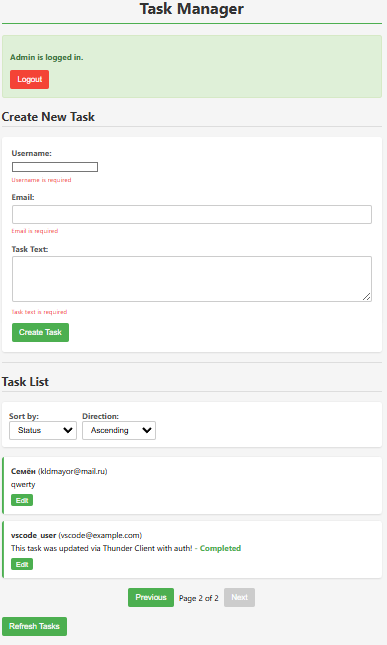

2. Создание задачи и валидация:
Действие 1: Не заполняя поля в форме "Create New Task", нажмите кнопку "Create Task".
Проверка 1: Появились ли ошибки валидации под полями? (Да/Нет) Да
Действие 2: Введите в поле "Email" значение "test" и снова нажмите "Create Task".
Проверка 2: Появилась ли ошибка валидации для поля email (например, "Invalid email format")? (Да/Нет) Да
Действие 3: Заполните форму корректными данными: Username: "test", Email: "test@test.com ", Text: "test job". Нажмите "Create Task".
Проверка 3:
Появилось ли оповещение об успехе (alert или сообщение)? (Да/Нет) Да
Появилась ли новая задача в списке с введенными данными? (Да/Нет) Да
Результат:
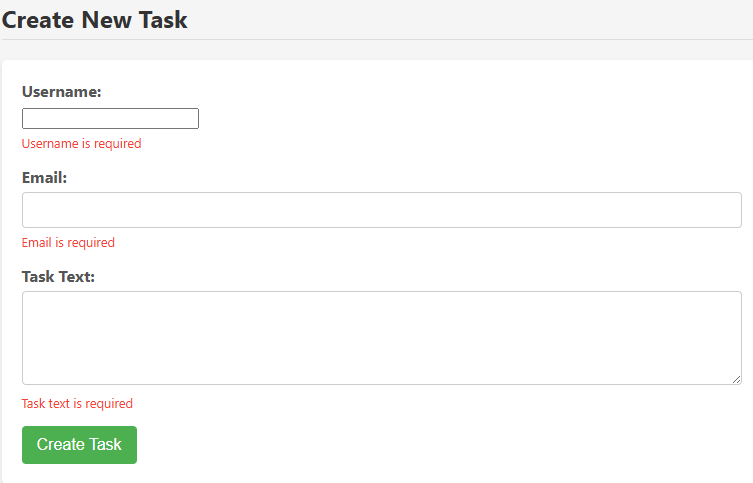
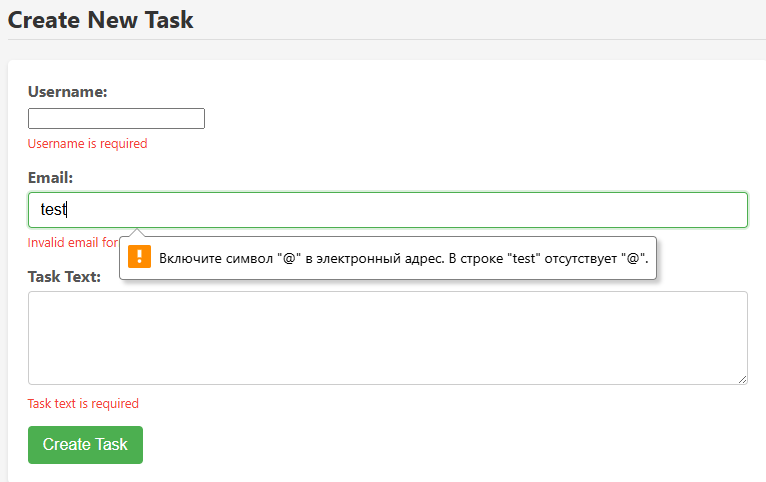
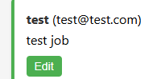

3. Проверка на XSS уязвимость:
Действие: Создайте новую задачу. В поле "Task Text" введите потенциально вредоносный скрипт: . Заполните остальные поля корректно и создайте задачу.
Проверка:
Задача появилась в списке? (Да/Нет) Да
Критично: Появилось ли всплывающее окно alert с текстом 'XSS Test'? (Да/Нет) (Оно НЕ должно появляться). Нет
Результат:
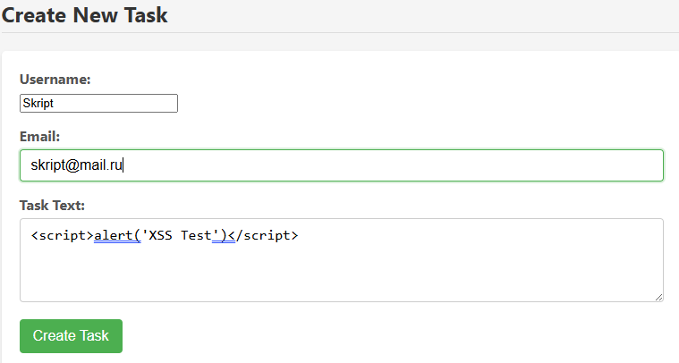
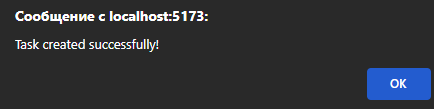
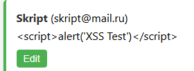

4. Пагинация:
Действие: Создайте еще 2-3 задачи, чтобы общее количество стало больше 3 (например, 5-6 задач). Обновите страницу или нажмите "Refresh Tasks".
Проверка:
Появились ли элементы пагинации ("Previous", "Next", номер страницы)? (Да/Нет) Да
Кликните "Next". Перешли ли вы на следующую страницу? (Да/Нет) Да
Кликните "Previous". Вернулись ли вы на первую страницу? (Да/Нет) Да
Результат:
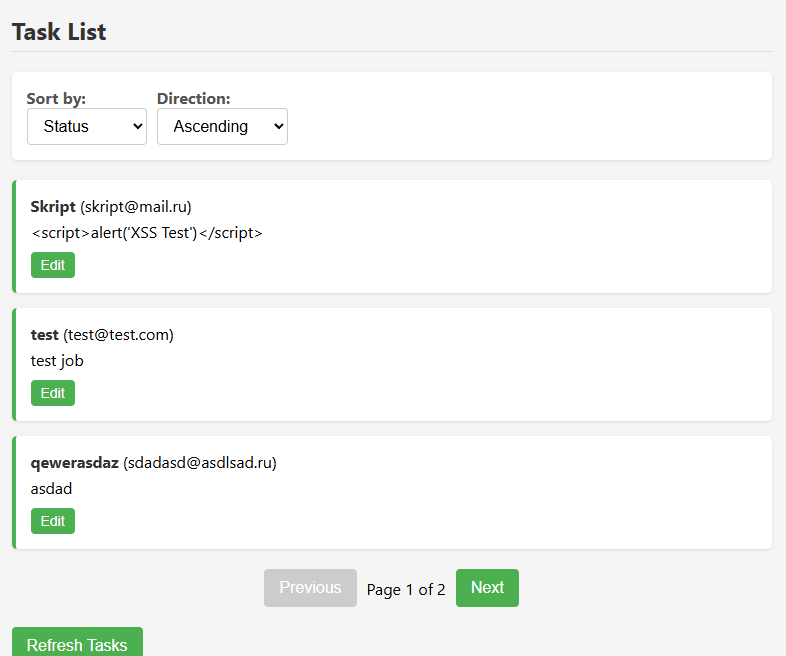
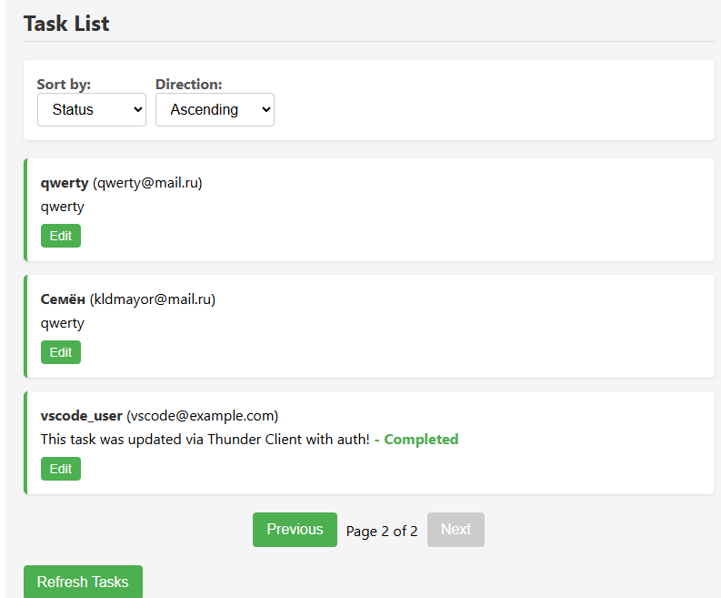

5. Сортировка:
Действие 1: Используйте выпадающий список "Sort by" и выберите "Username". Выберите направление "Ascending".
Проверка 1: Пересортировался ли список по имени пользователя по возрастанию? (Да/Нет) Да
Действие 2: Перейдите на последнюю страницу пагинации. Измените направление сортировки на "Descending".
Проверка 2: Список на текущей странице пересортировался по убыванию? (Да/Нет) Да
Действие 3: Перейдите на первую страницу. Повторите проверку сортировки для полей "Email" и "Status".
Проверка 3: Работает ли сортировка корректно для этих полей? (Да/Нет) Да
Результат:
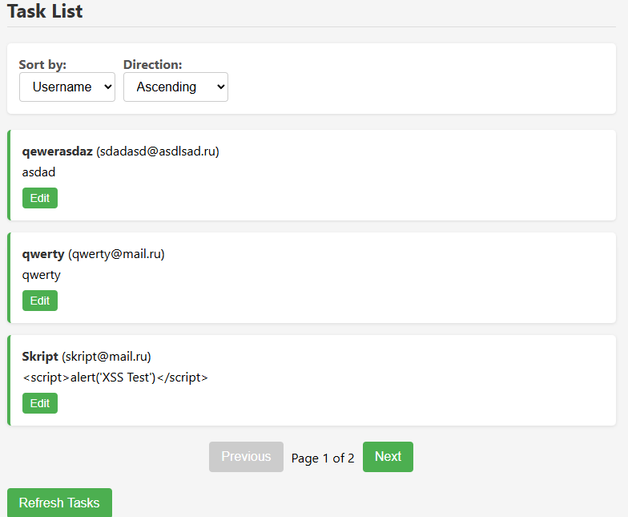
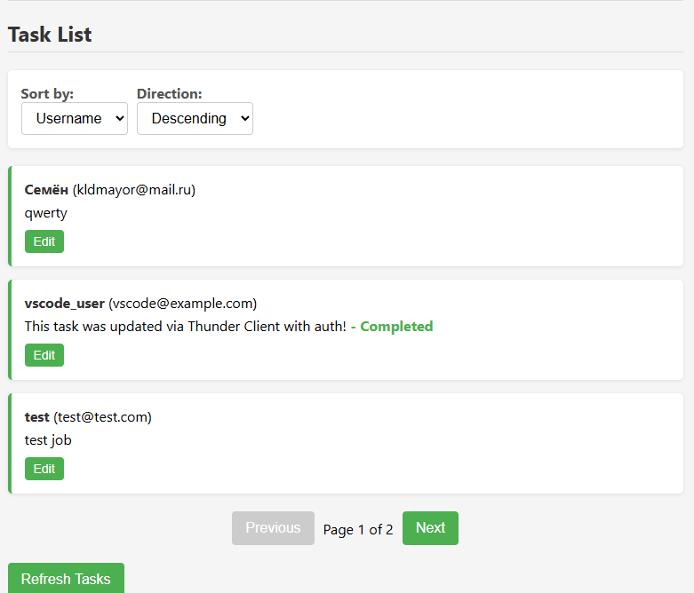
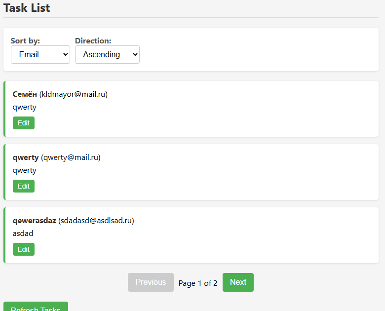
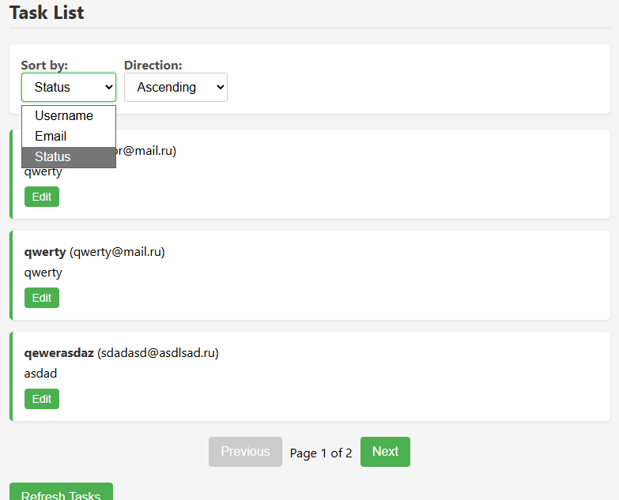

6. Авторизация администратора:
Действие 1: Нажмите кнопку "Login" в форме "Admin Login" с пустыми полями.
Проверка 1: Появилось ли сообщение об ошибке (например, "Username is required")? (Да/Нет) Да
Действие 2: Введите Username: "admin1", Password: "321". Нажмите "Login".
Проверка 2: Появилось ли сообщение об ошибке (например, "Invalid credentials")? (Да/Нет) Да
Действие 3: Введите Username: "admin", Password: "123". Нажмите "Login".
Проверка 3:
Успешно ли прошла авторизация (форма "Admin Login" заменилась на "Admin is logged in.")? (Да/Нет) Да
Появилась ли кнопка "Logout"? (Да/Нет) Да
Результат:
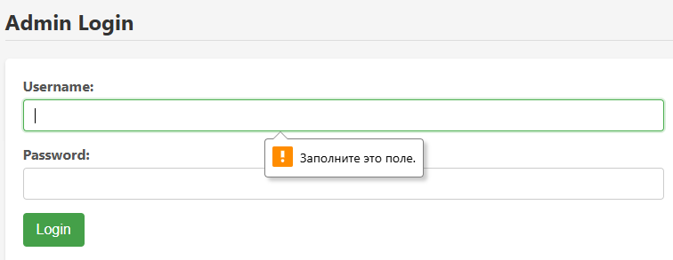
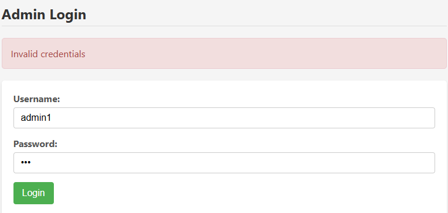
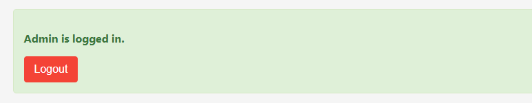

7. Редактирование задачи администратором:
Предварительное условие: Убедитесь, что вы залогинены как админ.
Действие 1: Найдите любую задачу в списке. Нажмите кнопку "Edit" рядом с ней. В открывшемся модальном окне поставьте галочку "Completed" и нажмите "Update Task".
Проверка 1: 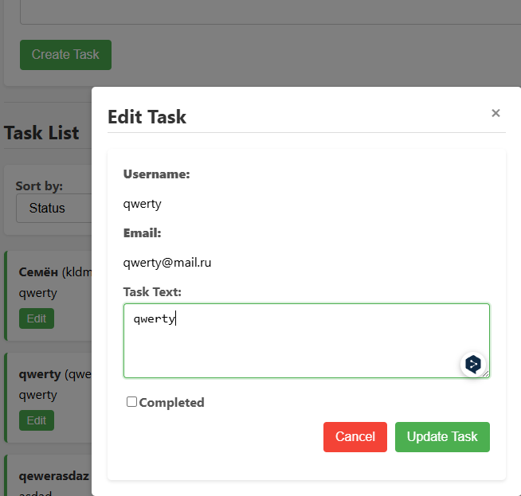 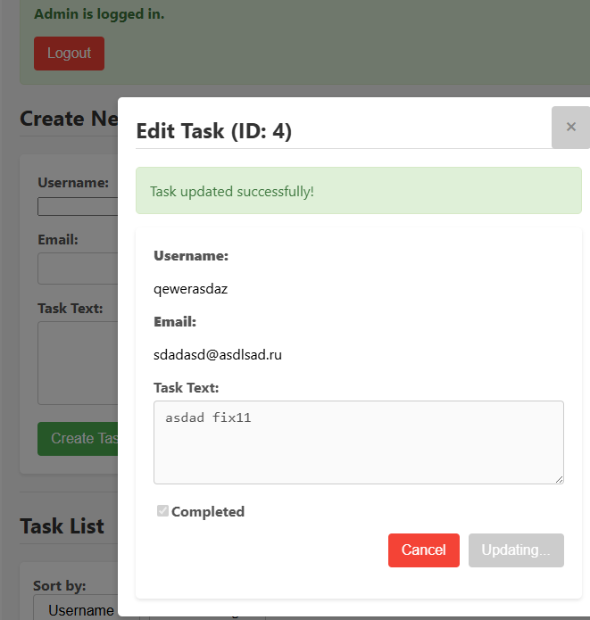
Появилось ли сообщение об успехе? (Да/Нет) Да
Закрылось ли модальное окно? (Да/Нет) Да
После обновления страницы (или нажатия "Refresh Tasks") отображается ли статус "Completed" рядом с задачей? (Да/Нет) Да
Действие 2: Снова нажмите "Edit" на той же задаче. Измените текст задачи (например, на "Updated text by admin"). Нажмите "Update Task".
Проверка 2: 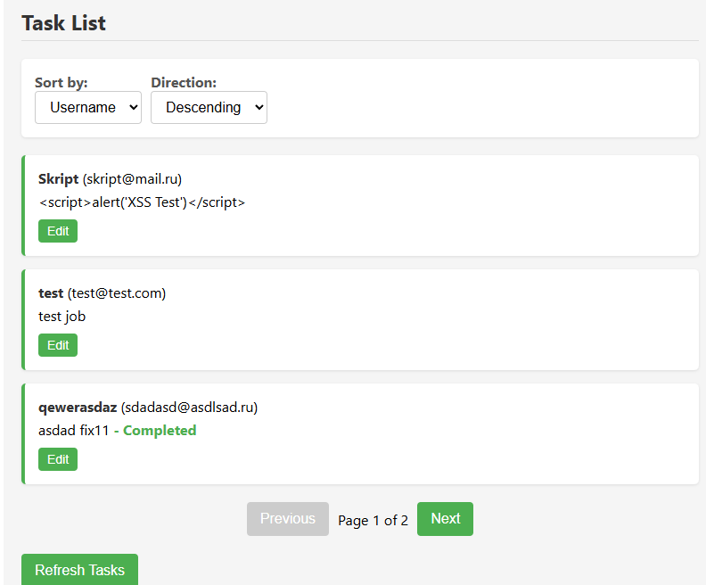 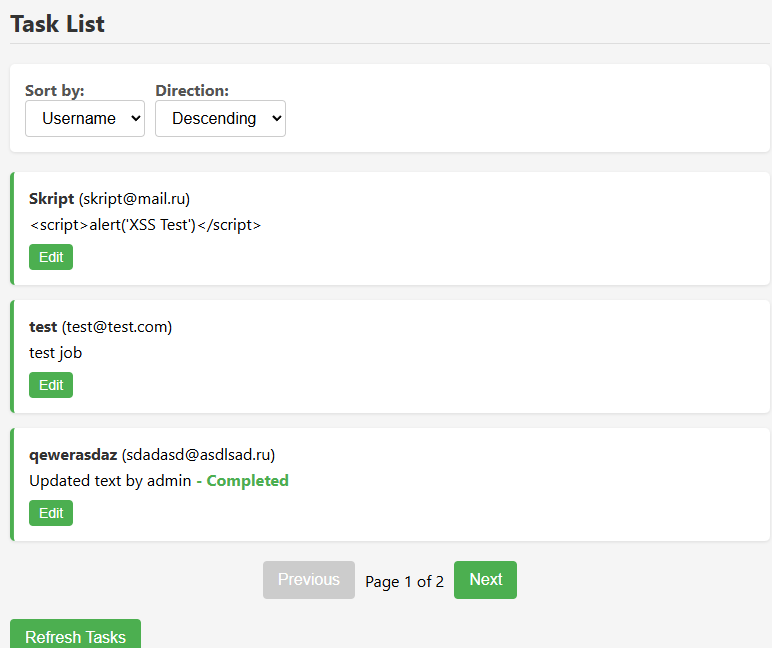
Появилось ли сообщение об успехе? (Да/Нет) Да
Закрылось ли модальное окно? (Да/Нет) Да
После обновления страницы отображается ли новый текст задачи? (Да/Нет) Да
Проверка 3 ("отредактировано администратором"):
Отображается ли рядом с задачей специальная отметка "отредактировано администратором"? (Да/Нет/Н/Д - Не определено, так как бэкенд не предоставляет эту информацию напрямую). Да 
Примечание: Если бэкенд не возвращает специальное поле (например, isAdminEdited), то эта отметка не может быть корректно реализована на 100% на фронтенде.
Результат: 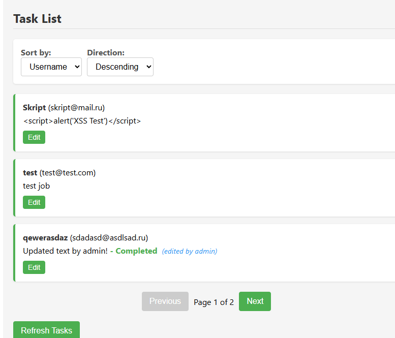

8. Поведение при разлогине в другой вкладке (Опционально/Продвинуто):
Действие 1: Откройте ваше приложение в новой вкладке браузера (http://localhost:5173).
Проверка 1: Убедитесь, что вы залогинены как админ в обеих вкладках (видны кнопки "Edit"). Да
Действие 2: В новой вкладке нажмите кнопку "Logout".
Действие 3: Вернитесь в первую вкладку. Попробуйте нажать кнопку "Edit" на любой задаче. 
Проверка 3: Что произошло?
а) Кнопки "Edit" исчезли? (Да/Нет) Да
б) Модальное окно открылось, но при попытке "Update Task" появилась ошибка авторизации? (Да/Нет) Да
в) Ничего не изменилось, можно редактировать? (Да/Нет) (Это указывает на отсутствие синхронизации состояния между вкладками) Нет
Результат: 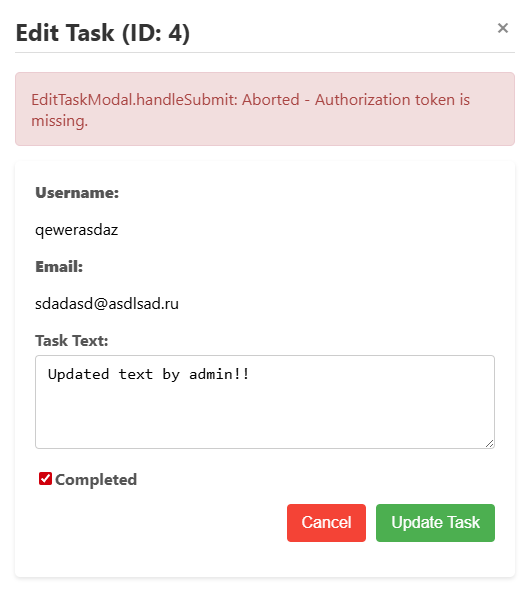